# CSE 542S Studio 1

1. Group member names
    1. Alex Kloppenburg
    2. Ben Kim
    3. Sam Yoo

2. Hostnames
    1. iht32-1503.engr.wustl.edu
    2. iht32-1502.engr.wustl.edu
    3. iht32-1507.engr.wustl.edu

3. Rust versions
    1. rustc 1.71.0 (8ede3aae2 2023-07-12)
    2. cargo 1.71.0 (cfd3bbd8f 2023-06-08)
    3. rustdoc 1.71.0 (8ede3aae2 2023-07-12)

4. Hello cargo files output
    1. 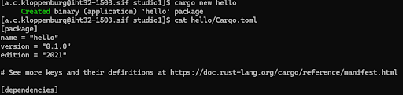
    2. 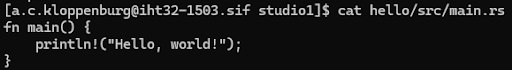

5. Cargo run output
    1. 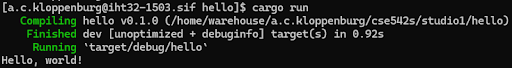

6. Hello binary output
    1. 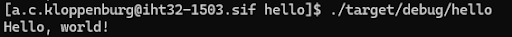

7. CSE 542S Programming Guidelines summaries
    1. Guideline A.4 basically states that, when submitting code, we should test it exhaustively.  Instead of designing our code to simply pass the tests of the assignment, we should be considering extra testing (edge cases, different input from the user or lack thereof, input at odd times, etc).
    2. Guideline B.1 states that we should avoid using the “unsafe” keyword when possible to ensure that the code is “safe”. If you were to use “unsafe” rust, you must explain in a comment why this was used and how it can still be considered safe.
    3. In the programming guidelines, these guidelines emphasize the importance of diligent practices in software development to enhance program reliability and readability, crucial for both solo and team programming contexts. Key points include ensuring programs compile and execute without errors, which if overlooked, could lead to significant grading deductions. The submission of a comprehensive readme file is encouraged to document the program’s function and any deviations from the assignment requirements. Testing has to be rigorous, considering various potential input scenarios to preempt runtime errors. Additionally, the guidelines advocate for clean code practices, like avoiding the use of hard coded constants and unnecessary use of ‘unsafe’ blocks, promoting a more maintainable and error-resistant codebase. Lastly, This practice ensures that any deviations from Rust’s strict safety guarantees are well-justified and transparent, thereby maintaining code integrity and security.

8. Cargo run
    1. Code:
        1. 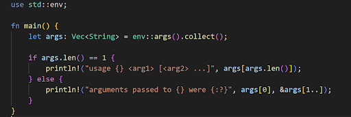

    2. No args:
        1. 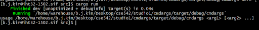

    3. Args:
        1. 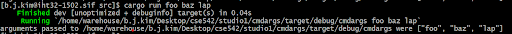

9. Cargo run
    1. No args:
        1. 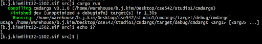

    2. Args:
        1. 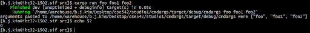

10. Result Type
    1. The outputs from this exercise differed from the previous exercise in the instance where no arguments were passed. Instead of having no output message, the message “Error: 1” was printed to the console. Whereas, the previous exercise had no error message. The outputs from the “echo $?” commands were the same; “0” where arguments were passed in and “1” for where arguments were not passed in.

11. Invalid Index
    1. 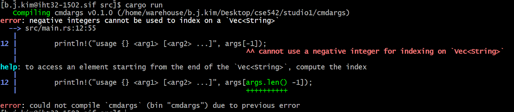

12. Invalid Index 2
    1. 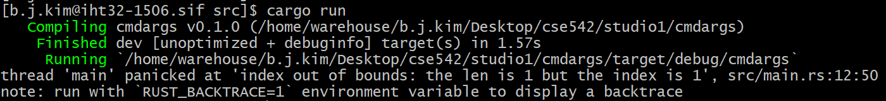
