# CSE 542S Studio 10

1. Student Names
    1. Sam Yoo
    2. Alex Kloppenburg
    3. Ben Kim

2. 
    1. Code
        1. 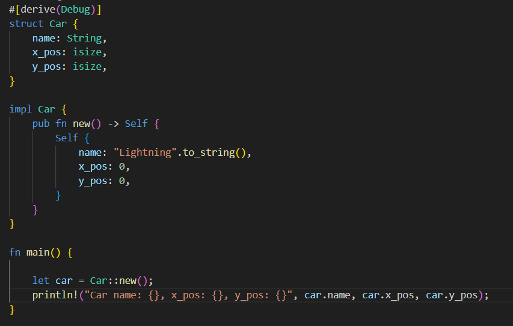
    2. Output
        1. 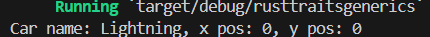

3. 
    1. Code
        1. 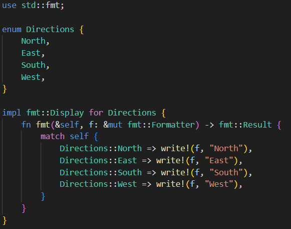
        2. 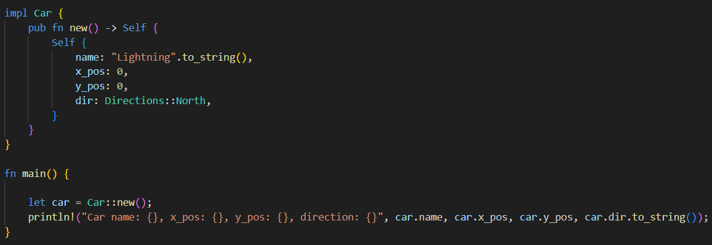
    2. Output
        1. 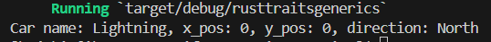

4. 
    1. Code
        1. 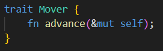
        2. 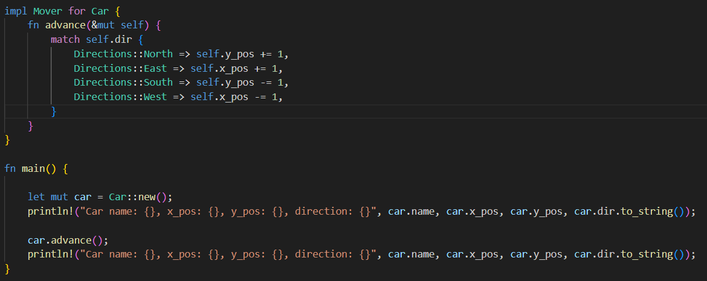
    2. Output
        1. 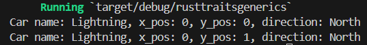

5. 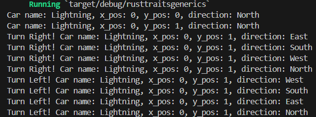

6. 
    1. Code
        1. 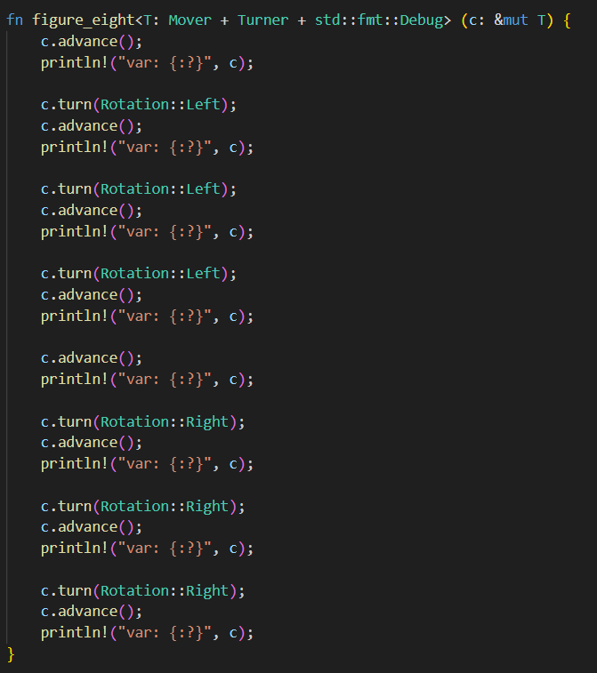
    2. Output
        1. 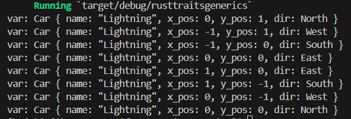