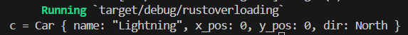
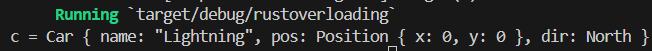
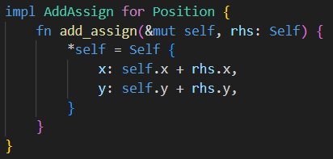
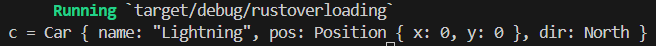
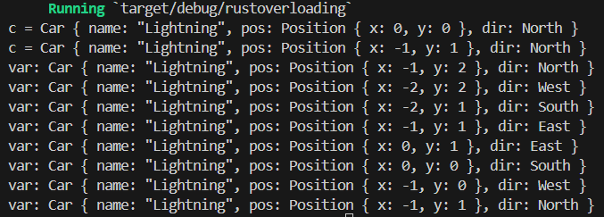
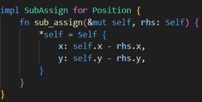
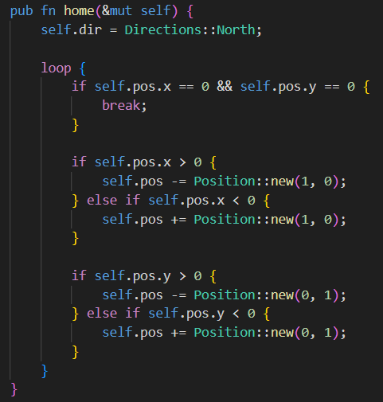
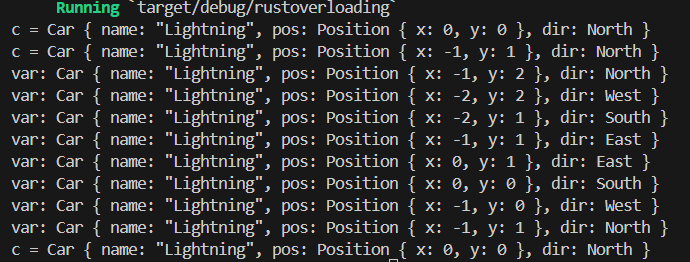

# CSE 542S Studio 11

1. Student Names
    1. Sam Yoo
    2. Alex Kloppenburg
    3. Ben Kim

2. 

3. 

4. 
    1. Code
        1. 
    2. Output
        1. 

5. The output is as shown below because turning left and advancing turning right and advancing from a north 0,0 starting position will end you back at a direction of north and position of -1,1. The figure8 function makes the car do a "figure 8" and return back to its starting position and direction. The new overloading operator does the same thing as what we were doing before because we are able to define what it means to add two instances of a Position struct. We are adding the x positions together and adding the y positions together.
    1. 

6. 
    1. Code
        1. 
        2. 
    2. Output
        1. 