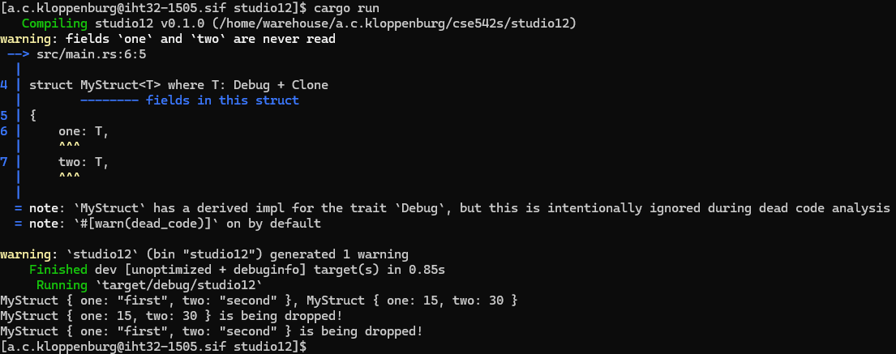

# Studio 12

1. Student Names
    1. Sam Yoo
    2. Alex Kloppenburg
    3. Ben Kim

2. Struct Implementation
    1. Code
        1. 
    2. Output
        1. 

3. Drop Implementation
    1. Code
        1. 
    2. Output
        1. 
    3. Fields in structs are normally dropped in the order they're declared, but since `MyStruct` only has one field, drop order falls to the variables themselves.  Since declared/scoped variables are dropped in reverse declaration order, that means that `second` is dropped first, and `first` is dropped second.  Confusing, I know.

4. Generic Parameters
    1. Code
        1. 
    2. Additional Changes
        1. The main additional changes needed were type restrictions.  Since the studio asks for us to print the struct out, `T` needs to at least implement `Debug` or `Display`.  Additionally, since `T` doesn't have an easy-to-use function like `to_string()`, `T` needs to implement `Clone` as well, to allow us to easily get a `T` from a `&T` in `new()`.  We also changed the struct name to `MyStruct` since it was no longer solely for Strings.

5. Two Fields
    1. 

6. Default Implementation
    1. 

7. Default and Drop
    1. There was not an error, which makes sense when you consider that all `Default::default()` is supplying is a default `String` or `u16`.  `Drop` still knows how to get rid of those, same as if we'd provided the values manually.
