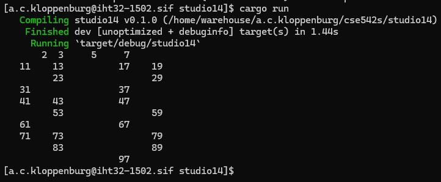

# Studio 14

1. Student Names
    1. Sam Yoo
    2. Alex Kloppenburg
    3. Ben Kim

2. Print Integers
    1. Code
        1. 
    2. Output
        1. 

3. Print Odds
    1. Output
        1. 

4. Collect and Map
    1. Code
        1. 

5. Primes
    1. Output
        1. 

6. Using for_each
    1. Code
        1. 

7. Optimized
    1. Code
        1. 
