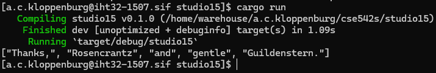
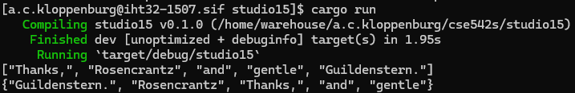
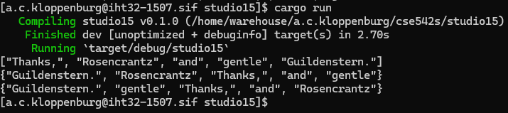
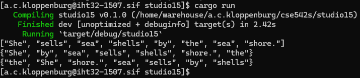
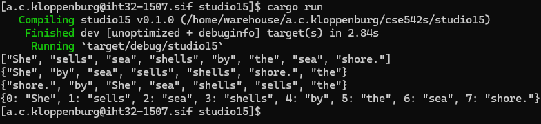
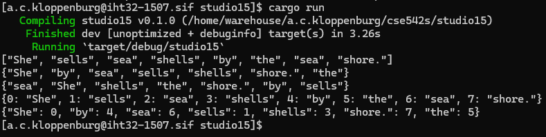
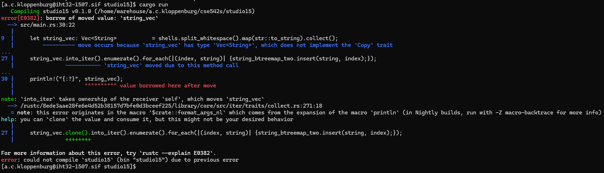

# Studio 15

1. Student Names
    1. Sam Yoo
    2. Alex Kloppenburg
    3. Ben Kim

2. Vector of Strings
    1. Code
        1. 
    2. Output
        1. 

3. BTreeSet
    1. Output
        1. 
    2. Both collections contained the same `Strings`, but they were ordered differently.  The `Vec` contained the strings in the order they were in the initial string, since `split_whitespace()` splits the `String` in place without changing its ordering.  `BTreeSet` (and the underlying `BTreeMap`) maintain an ordered B-tree, so the strings we get from `split_whitespace()` are compared with each other and shifted around as determined by `Ord`.

4. HashSet
    1. Output
        1. 
    2. As with the previous question, all three collections contained the same `Strings`, but they were ordered differently.  The `Vec` contained the strings in the order they were in the initial string, since `split_whitespace()` splits the `String` in place without changing its ordering.  `BTreeSet` (and the underlying `BTreeMap`) maintain an ordered B-tree, so the strings we get from `split_whitespace()` are compared with each other and shifted around as determined by `Ord`.  The `HashSet`, however, is ordered differently from the `Vec` and the `BTreeSet` since its ordering is done by the hashes of the strings, not by the strings themselves.

5. New String
    1. Output
        1. 
    2. The new string contains a repeated word, "sea", and since both `BTreeSet` and `HashSet` need their values to be unique, the second "sea" is discarded.

6. BTreeMap
    1. Output
        1. 
    2. The output for the `BTreeMap` is actually most similar to the `Vec` (aside from the `BTreeMap` using `usize` keys), which makes sense because each value inserted into the `BTreeMap` is made unique by it's key.  The `BTreeMap` contains "sea" twice, because `(2, "sea")` and `(6, "sea")` are two different values, unlike the `HashSet` or `BTreeSet`.

7. Second BTreeMap
    1. Output
        1. 
    2. The second `BTreeMap` is most similar to the `BTreeSet`, which makes sense.  Switching the order of the `String` and `usize` values means that the second `BTreeMap` is ordered by `String` rather than by `usize`, so it should make the same comparisons and result in the same ordering that the `BTreeSet` did.

8. Cloning
    1. Error
        1. 
    2. The program failed because of a borrow/move error - when creating one of the `BTreeMaps` the `Vec` of strings is consumed and cannot be used when it comes time to print at the end.
