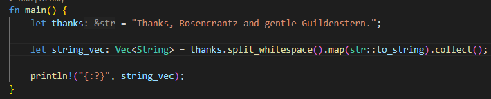

# Studio 15

1. Student Names
    1. Sam Yoo
    2. Alex Kloppenburg
    3. Ben Kim

2. Vector of Strings
    1. Code
        1. 
    2. Output
        1. 

3. BTreeSet
    1. Output
        1. 
    2. blah blah blah

4. HashSet
    1. Output
        1. 
    2. blah blah blah

5. New String
    1. Output
        1. 
    2. blah blah blah

6. BTreeMap
    1. Output
        1. 
    2. blah blah blahg

7. Second BTreeMap
    1. Output
        1. 
    2. blah blah blah

8. Cloning
    1. Error
        1. 
    2. blah blah blah
