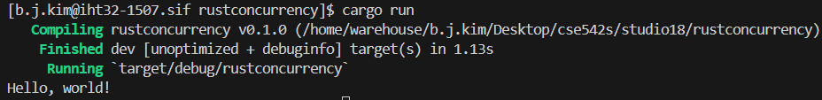
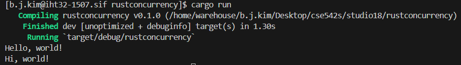
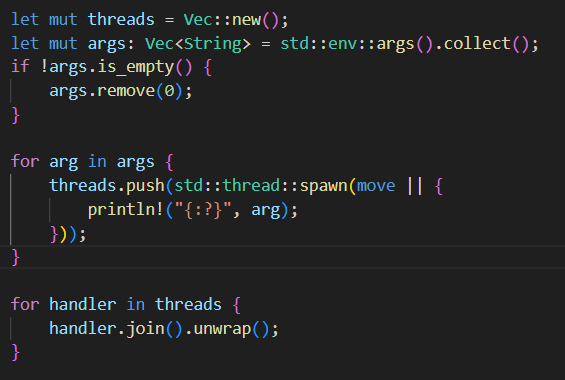
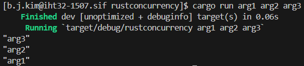
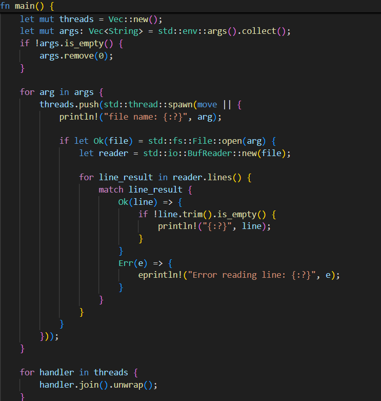
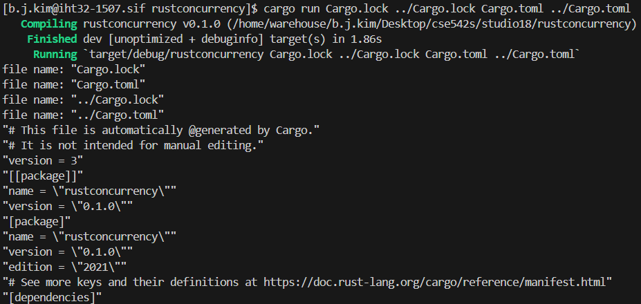
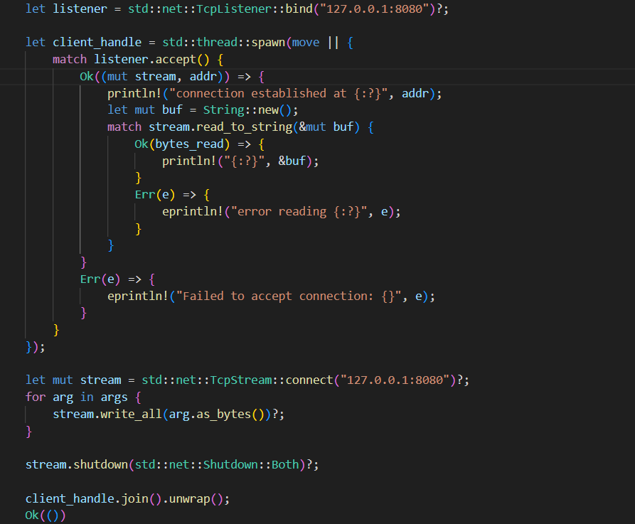
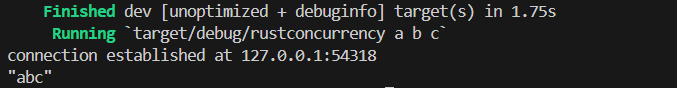

# Studio 18

1. Student Names
    1. Sam Yoo
    2. Alex Kloppenburg
    3. Ben Kim

2. 

3. 

4. 

5. 

6. 

7. The program does not terminate until the terminate signal is given because the thread is blocked on the listener.accept() call.
Because the main thread is blocking on the join() function of the background thread, it also cannot finish until the other thread has
finished.

8. An extra call to connect is needed for the program to terminate because the listener thread is still blocked on the listener.accept()
call. Once we call shutdown and update the static atomic flag, the background thread will not unblock until another client connects to the listener. Once the connection occurs it prints and checks that the flag was set to true and breaks out of the loop.