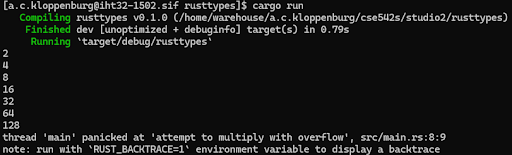
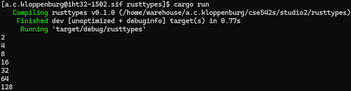
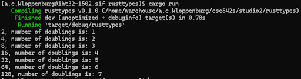
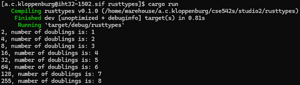
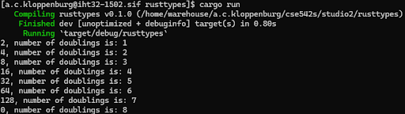
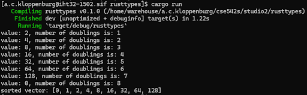

# CSE 542S Studio 2

1. Student Names
    1. Alex Klopenburg
    2. Sam Yoo
    3. Ben Kim

2. Basic Overflow
    1. 

3. Checked_mul
    1. 

4. Overflowing_mul
    1. 

5. Saturating_mul
    1. 

6. Wrapping_mul
    1. 

7. Vector
    1. 
