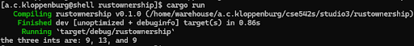
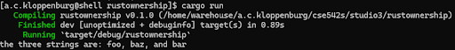
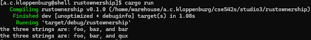
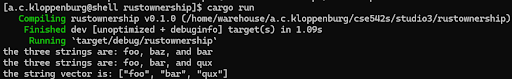

# CSE 542S Studio 3

1. Student Names
    1. Alex Kloppenburg
    2. Ben Kim
    3. Sam Yoo

2. Ints
    1. 

3. Strings with move error
    1. The error that occurred was a “borrow of moved value” error.  It occurred because of how rust handles ownership of complex types like strings - when we assign the second variable to the third, it is moved rather than copied (unlike u8s or other simple types).  The third variable now has ownership of that value, and the second value is now uninitialized.  Thus, trying to print it results in an error, since there’s not actually anything to print anymore.

4. Strings fixed
    1. 

5. Strings with move error 2
    1. This is the same type of error as exercise 3.  Since the third variable was assigned to the second one, the second now has ownership of that value and the third variable causes an error when println!() attempts to access it.

6. Strings fixed 2
    1. 

7. Mutable vector
    1. 

8. Vector indexing
    1. This error is similar to the other two - assignment of the vector index to the fourth variable would result in that index being uninitialized due to the ownership of the value being moved.  It needs to be popped or a reference used, so that the vector can maintain its values correctly.

9. Vector pop
    1. 
