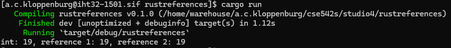
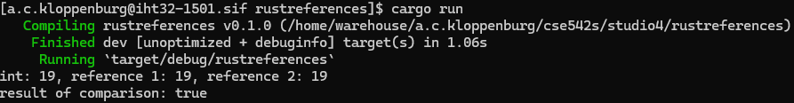
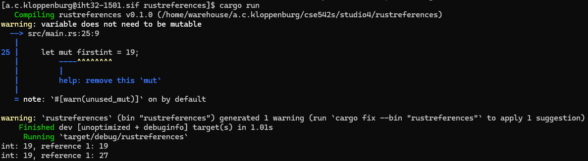
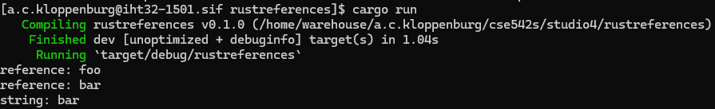

# CSE 542S Studio 4

1. Student Names
    1. Ben Kim
    2. Sam Yoo
    3. Alex Kloppenburg

2. Printing References
    1. 

3. Comparing References Error
    1. The compiler complains about there being "no implementation for `{integer} == &{integer}`".  This is because the compiler is able to "see through", or implicitly dereference, as many layers of references as needed, but they must always be the same number of layers.  In this case, `&i32` and `&&i32` result in `i32` and `&i32`.  The textbook never actually explained why, but a bit of googling tells us that doing so would actually cause lifetime issues in the `PartialEq` comparison code, causing Rust to violate its own guidelines!  The solution is to dereference one of the values with *, like we do in step 4.

4. Using the * Operator
    1. 

5. Using the * Operator Multiple Times
    1. The Rust compiler is able to implicitly dereference variables if needed, but only when the LHS and RHS have the same number of references.  In the case of step 4, `&i32` and `*&&i32` work out to `&i32` and `&i32`, which the compiler is able to implicitly dereference to `i32` and `i32` and compare.  In this step, we're simply explicitly doing that dereferencing, giving us the exact same answer.

6. Mutable Error
    1. The compiler complains that the value "is assigned to here but it was already borrowed".  The error occurs because the two references are still pointing to the original value of the first variable, and changing that value would cause issues with them, so Rust doesn't allow it.  We need to either not change the variable's value, or get rid of all the references pointing to it.

7. Mutable Reference Error
    1. This is the same error, because we still have another reference that's referring to the first one.  We've fixed the issue of the first reference borrowing from the first variable, but the second reference is not mutable and we run into the same issue.  We need to remove or make mutable that second reference as well if we want to be error-free.

8. Mutable Reference Error Fixed
    1. 

9. Mutable String References
    1. 
