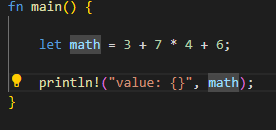
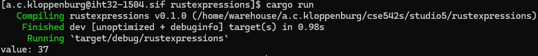
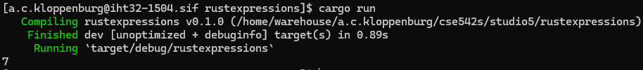
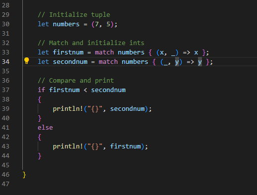
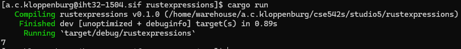
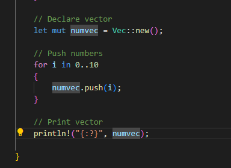
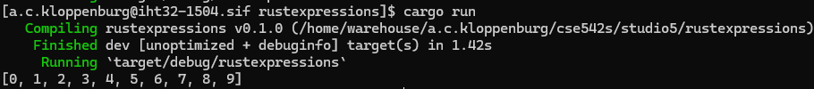
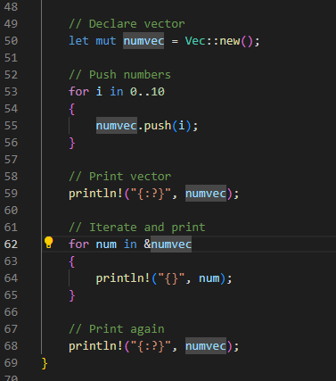
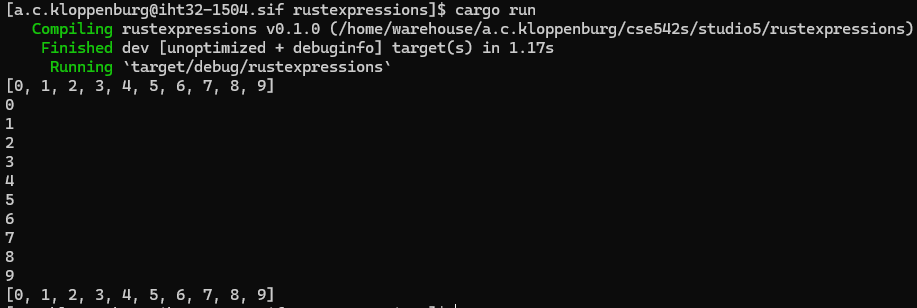

# CSE 542S Studio 5

1. Student Names
    1. Alex Kloppenburg
    2. Ben Kim
    3. Sam Yoo

2. Arithmetic Operators
    1. Code
        1. 
    2. Output
        1. 
    3. The multiplication operator has higher pecedence, which is clear when you look at the result of the expression.  7 * 4 is performed first, and then the addition is done.  This results in 3 + 28 + 6, equaling 37.  If the addition operator had precedence, we'd end up with a result of 100.

3. If-Else Compare
    1. Code
        1. 
    2. Output
        1. 

4. If-Else With Semicolon
    1. If a semicolon is added before the `else` block, the compiler thinks the `if` block is done, and spits out a warning about what it considers to be a dangling `else`.  Every `else` needs to have a corresponding `if`.

5. Tuple Matching
    1. Code
        1. 
    2. Output
        1. 

6. For Loop With Vector
    1. Code
        1. 
    2. Output
        1. 

7. 2 For Loops Error
    1. The error that occurs here happens when we try to print again after the second for loop.  Accessing each value of a vector, like we do in the second for loop, moves ownership of those values to the print statements.  When we try to print it again, the values are no longer present and we get an error.  Iterating over a reference would fix this.

8. Iterating Over A Reference
    1. Code
        1. 
    2. Output
        1. 
