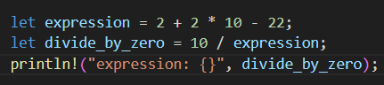
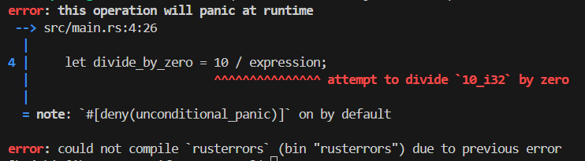
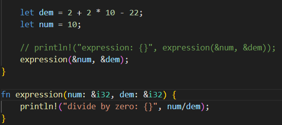
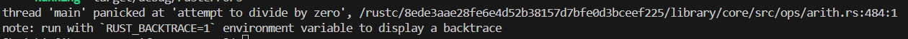
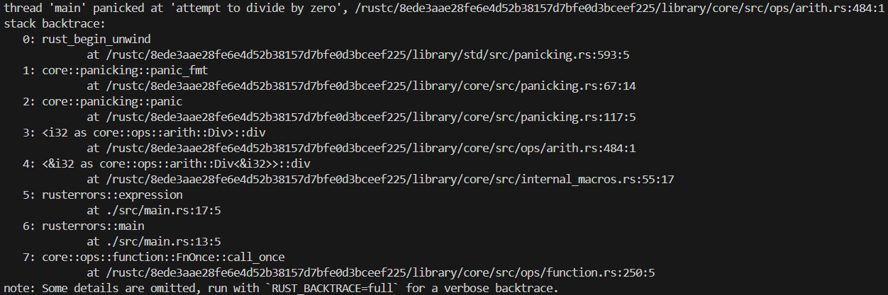
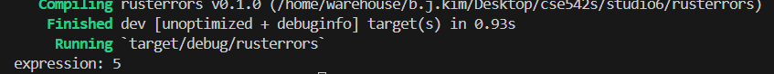
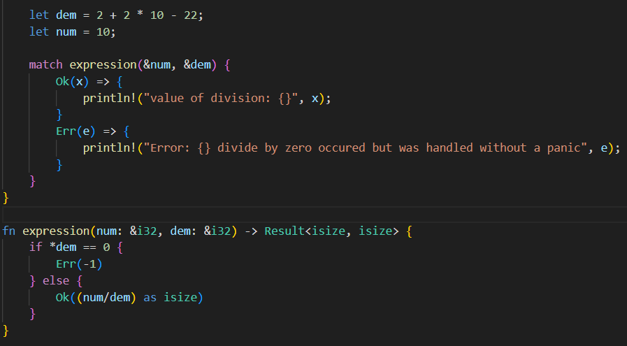
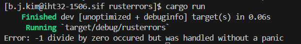
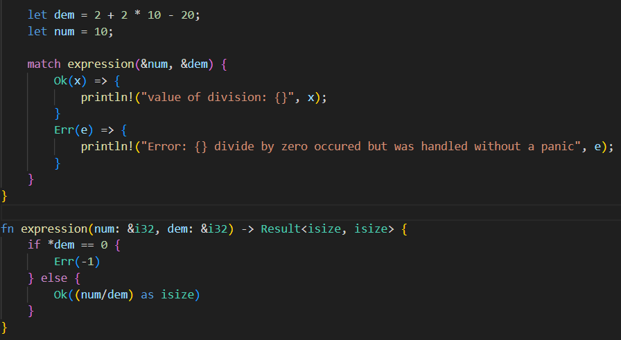
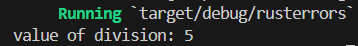

# CSE 542S Studio 6

1. Student Names
    1. Sam Yoo
    2. Alex Kloppenburg
    3. Ben Kim

2. The divide by zero was handled as a compilation error warning the user that the operation will panic at runtime.
    1. Code
        1. 
    2. Output
        1. 

3. The divide by zero was handled as a runtime error where the program panics at the divide by zero.
    1. Code
        1. 
    2. Output
        1. 

4. 

5. 

6. Using the initialization values that have the denominator as 0 causes the divide by 0 error and the denominator with a value of 2 does not cause the divide by 0 error.

7. 
    1. Error Code
        1. 
    2. Error Output
        1. 
    3. Non-Error Code
        1. 
    4. Non-Error Output
        1. 
