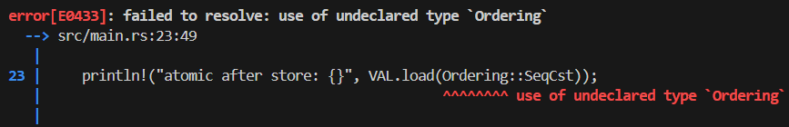

# CSE 542S Studio 7

1. Student Names
    1. Sam Yoo
    2. Alex Kloppenburg
    3. Ben Kim

2. 
    1. Code
        1. 
    2. Output
        1. 

3. 
    1. Code
        1. 
    2. Output
        1. 

4. 

5. 
    1. Code
        1. 
    2. Output
        1. 

6. 
    1. Code
        1. 
    2. Output
        1. 

7. 

8. 

9. 
    1. Code
        1. 
    2. Output
        1. 
