# CSE 542S Studio 8

1. Student Names
    1. Sam Yoo
    2. Alex Kloppenburg
    3. Ben Kim

2. 
    1. Code
        1. 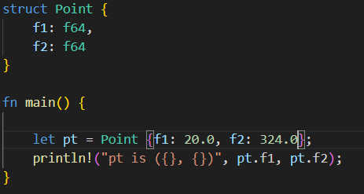
    2. Output
        1. 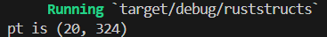

3. 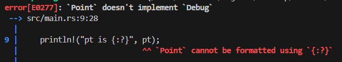

4. 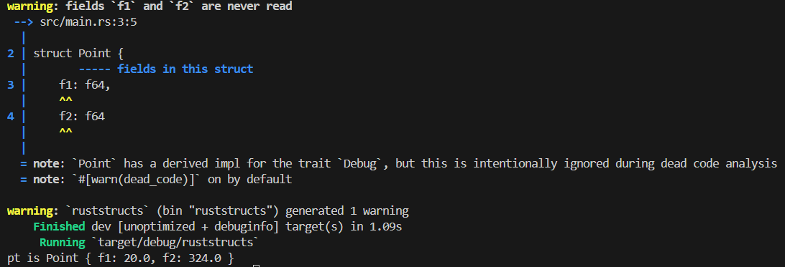

5. 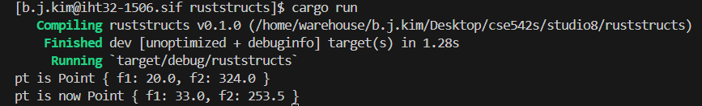

6. 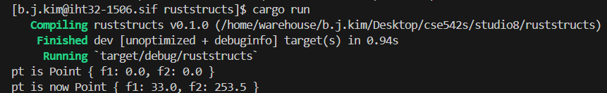

7. 
    1. Code
        1. 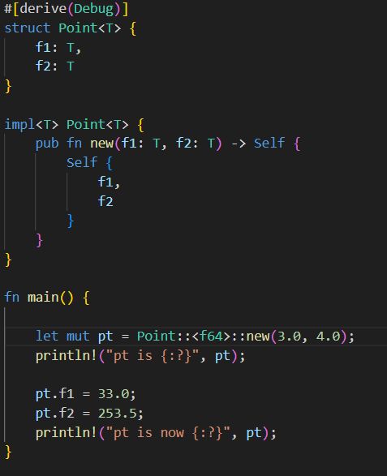
    2. Output
        1. 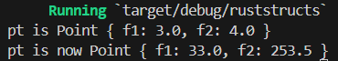

8. 
    1. Code
        1. 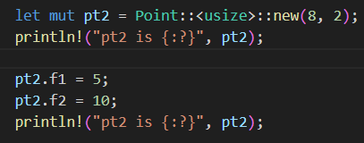
    2. Output
        1. 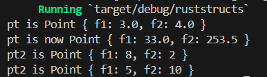

9. The warning of dead code does not occur in this case because the set method is indirectly accessing the fields. This indicates to the compiler that those fields are getting used. Without calling the set function, you will still get the warning. This shows it is not necessary to access the fields directly.
    1. Code
        1. 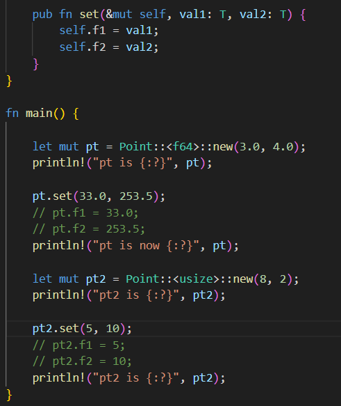
