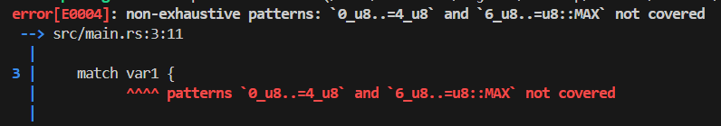
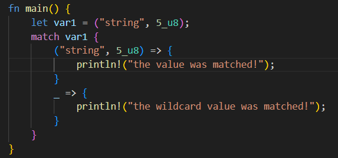
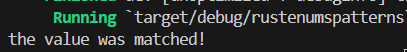
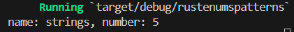
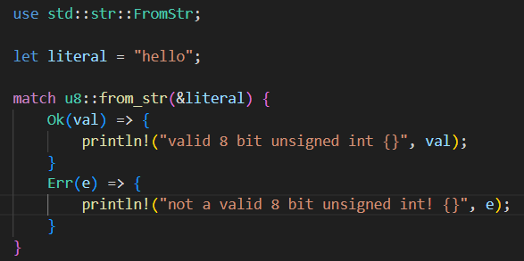
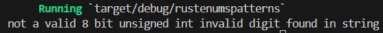
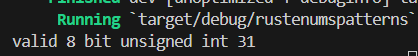
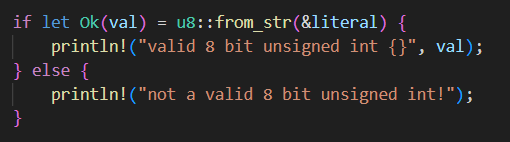

# CSE 542S Studio 9

1. Student Names
    1. Sam Yoo
    2. Alex Kloppenburg
    3. Ben Kim

2. 

3. When the wildcard pattern is before the arm with the initialized unsigned integer, the arm with the wildcard pattern is used. This is because the wildcard pattern matches any value, and therefore it never checks the arm below that arm because it goes directly out of the match statement afterwards. However, if the wildcard pattern arm is after the arm with the initialized unsigned integer, it goes into the arm of the uninitialized unsigned integer first and then exits the match statement.

4. 
    1. Code
        1. 
    2. Output
        1. 

5. The output changed from the previous exercise because the first arm in the match statement does not exactly match the initialized tuple. Therefore, it goes into the wildcard arm and prints out a different output than the previous exercise.

6. This time there is no error for having a single arm because the single arm covers all the potential patterns that the match statement can produce.
    1. 

7. 
    1. Code
        1. 
    2. Output with "hello"
        1. 
    3. Output with "31"
        1. 

8. 